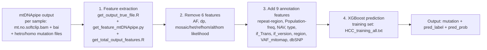

# mtDNA-ML-Predictor

A machine-learning pipeline for predicting low-frequency mitochondrial DNA (mtDNA) mutations from [mtDNApipe](https://github.com/FMMU-Xing-Lab/mtDNApipe) variant-calling outputs.

The pipeline takes the per-sample mitochondrial BAM and mutation files (hetro/homo) produced by mtDNApipe, extracts 29 alignment/sequencing features, removes 6 features that are no longer used, adds 9 annotation features, and finally trains an XGBoost model on the HCC tissue training set to predict every candidate mutation in new samples.

## Workflow



The final prediction output contains only three columns: the mutation ID (`sample~chrM~position~reference_base~mutant_base`), the predicted class (0/1), and the probability of being a real mutation.

## Requirements & Installation

A Linux server is required. The following tools must be available:

- `python3` (>= 3.7) with: `pysam`, `pandas`, `numpy`, `scipy`, `regex`, `pyfaidx`, `xgboost`, `scikit-learn`
- `Rscript` (the R scripts only use base R; no additional R packages are needed)
- `samtools` (builds the reference index and computes read lengths)

Recommended: create the conda environment in one step:

```bash
conda env create -f environment.yml
conda activate mtdna-ml
```

Or install with pip:

```bash
python3 -m pip install -r requirements.txt
# samtools and R can be installed with your system package manager, e.g.:
# sudo apt-get install -y samtools r-base
```

Before running, you can automatically check whether the current environment is ready:

```bash
bash check_environment.sh
```

The master pipeline `run_pipeline.sh` runs this environment check automatically by default (skip it with `-k`).

## Input Requirements

Put all samples in one analysis folder (e.g., `sample_dir/`). Either of the following layouts is accepted:

Layout 1 (recommended: one sub-folder per sample):

```text
sample_dir/
├── S1/
│   ├── S1.mt.no.softclip.bam
│   ├── S1.mt.no.softclip.bam.bai   (or S1.bai)
│   ├── S1.hetro_0.1.txt
│   └── S1.homo_0.1.txt
└── S2/
    └── ...
```

Layout 2 (flat; the pipeline will organize it into Layout 1 automatically):

```text
sample_dir/
├── S1.mt.no.softclip.bam
├── S1.bai
├── S1.hetro_0.1.txt
├── S1.homo_0.1.txt
└── ...
```

Notes:

- Samples are identified by `*.mt.no.softclip.bam` files; `*.mt.bam` names are also accepted automatically.
- The `0.1` in the hetro/homo file names is the VAF tag and must match the `-v` argument (default: `0.1`).
- The reference genome must be the same reference used for alignment (the bundled default is rCRS with the sequence named `chrM`).

## Quick Start

```bash
bash run_pipeline.sh -i /path/to/sample_dir -t 8
```

Common options:

```bash
bash run_pipeline.sh \
    -i /path/to/sample_dir \          # analysis folder containing the samples
    -o /path/to/outputs \             # output directory for final results (default: sample_dir/outputs)
    -c 2 \                            # cutoff (%) for low-frequency variants; no filtering by default,
                                      # enable it with the environment variable APPLY_CUTOFF=1
    -v 0.1 \                          # VAF tag used in the hetro/homo file names
    -t 8 \                            # number of parallel feature-extraction jobs
    -r /path/to/human_mtDNA.fasta \   # reference genome (default: bundled rCRS)
    -T /path/to/HCC_training_all.txt \# training set (default: bundled data)
    -s data1                        # sample/cohort name (used in the log)
```

Run the steps individually (equivalent to the master pipeline):

```bash
# 1) Feature extraction
bash scripts/get_feature_pipeline.sh /path/to/sample_dir 2 8 0.1 reference/human_mtDNA.fasta

# 2) Remove the 6 unused features
python3 scripts/delete_features.py \
    --input /path/to/sample_dir/Total_output_feature_0.1.txt \
    --output outputs/feature.txt

# 3) Add the annotation features
python3 scripts/add_features.py \
    --input outputs/feature.txt \
    --output outputs/feature_add10.txt \
    --data-dir data

# 4) Train + predict
python3 scripts/predict.py \
    --train data/HCC_training_all.txt \
    --predict outputs/feature_add10.txt \
    --output outputs/data1-pred-results.txt \
    --sample-name data1
```

## Output Files

| File | Description |
| --- | --- |
| `<sample_dir>/output_true_<vaf>` | Candidate variant sites per sample (chrM, position, bases, frequency) |
| `<sample_dir>/Total_output_feature_<vaf>.txt` | Aggregated 29-column raw features for all samples |
| `<output>/feature.txt` | 23-column feature table after removing the 6 features |
| `<output>/feature_add10.txt` | 32-column feature table after adding the 9 annotation features |
| `<output>/<sample_set>-pred-results.txt` | Final predictions: `id`, `pred_label`, `pred_prob` |


## Citation

If you use this pipeline, please cite mtDNApipe and the original paper of this project (to be added once published).
