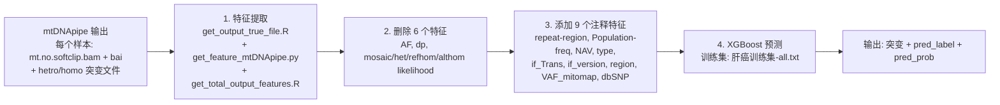

# mtDNA-ML-Predictor

基于 mtDNApipe 突变速率的线粒体低频突变机器学习预测流程。

本流程接收 [mtDNApipe](https://github.com/FMMU-Xing-Lab/mtDNApipe) 跑出的每个样本的线粒体 BAM 和突变文件（hetro/homo），提取 29 个比对/测序特征，删除其中 6 个不再使用的特征，再添加 9 个注释特征，最后用肝癌组织训练集训练 XGBoost 模型并对新样本的每个候选突变进行预测。

## 工作流程



最终预测结果只保留三列：突变 ID（`样本~chrM~位置~参考碱基~突变碱基`）、预测类别（0/1）、预测为突变的概率。

## 目录结构

```text
mtDNA-ML-Predictor/
├── run_pipeline.sh            # 一键主流程（推荐入口）
├── check_environment.sh       # 环境检测（运行前自动检查）
├── download_reference.sh      # 重新下载线粒体参考基因组（rCRS）
├── requirements.txt           # pip 依赖
├── environment.yml            # conda 环境（推荐）
├── LICENSE
├── README.md
├── scripts/
│   ├── organize_samples.sh          # 整理样本目录 / 生成 sample_name.txt
│   ├── get_feature_pipeline.sh      # 特征提取（原 get_mtDNApipe_feature.sh 的便携版）
│   ├── get_output_true_file.R       # 准备候选突变位点 output_true_<vaf>
│   ├── get_feature_mtDNApipe.py     # 逐样本提取比对特征（并行）
│   ├── get_total_output_features.R  # 汇总所有样本特征
│   ├── delete_features.py           # 删除 6 个特征（替代原手动删除）
│   ├── add_features.py              # 添加 9 个注释特征（原 添加10个特征.py 的便携版）
│   └── predict.py                   # 训练 + 预测（原 预测集验证.py，输出已精简）
├── data/
│   ├── HCC_training_all.txt         # 肝癌训练集（原 肝癌训练集-all.txt）
│   ├── dbSNP.txt
│   ├── mitomap.txt
│   ├── mitomap-snp.txt
│   ├── region.txt
│   └── mtDNA_region_ge5.txt         # 原 mtDNA区间≥5.txt
└── reference/
    └── human_mtDNA.fasta            # rCRS (NC_012920.1)，序列名 chrM，16569 bp
```

## 环境要求与安装

需要 Linux 服务器，并安装：

- `python3`（>= 3.7）：`pysam`、`pandas`、`numpy`、`scipy`、`regex`、`pyfaidx`、`xgboost`
- `Rscript`（R 脚本只使用 base R，无需额外 R 包）
- `samtools`（建立参考基因组索引、统计读长）

推荐用 conda 一键创建环境：

```bash
conda env create -f environment.yml
conda activate mtdna-ml
```

或使用 pip：

```bash
python3 -m pip install -r requirements.txt
# samtools 和 R 请用系统包管理器安装，例如：
# sudo apt-get install -y samtools r-base
```

运行前可用下面的命令自动检测环境是否满足要求：

```bash
bash check_environment.sh
```

主流程 `run_pipeline.sh` 默认也会自动执行环境检测（可用 `-k` 跳过）。

## 输入数据要求

一个大分析文件夹（例如 `sample_dir/`），两种组织方式均可：

方式一（推荐，每个样本一个子文件夹）：

```text
sample_dir/
├── S1/
│   ├── S1.mt.no.softclip.bam
│   ├── S1.mt.no.softclip.bam.bai   (或 S1.bai)
│   ├── S1.hetro_0.1.txt
│   └── S1.homo_0.1.txt
└── S2/
    └── ...
```

方式二（平铺，脚本会自动整理成方式一）：

```text
sample_dir/
├── S1.mt.no.softclip.bam
├── S1.bai
├── S1.hetro_0.1.txt
├── S1.homo_0.1.txt
└── ...
```

说明：

- 特征提取脚本按 `*.mt.no.softclip.bam` 识别样本；如果你的 BAM 叫 `xxx.mt.bam`，脚本会自动兼容。
- hetro/homo 文件名中的 `0.1` 是 vaf 标签，必须与 `-v` 参数一致（默认 `0.1`）。
- 参考基因组必须是样本比对所用的一致参考（默认打包的是 rCRS，序列名为 `chrM`）。

## 快速开始

```bash
bash run_pipeline.sh -i /path/to/sample_dir -t 8
```

常用参数：

```bash
bash run_pipeline.sh \
    -i /path/to/sample_dir \    # 样本分析大文件夹
    -o /path/to/outputs \       # 最终结果输出目录（默认 sample_dir/outputs）
    -c 2 \                      # 低频突变 cutoff（%）；默认不过滤，设 APPLY_CUTOFF=1 生效
    -v 0.1 \                    # hetro/homo 文件名中的 vaf 标签
    -t 8 \                      # 并行提取特征的进程数
    -r /path/to/human_mtDNA.fasta \  # 参考基因组（默认使用包内 rCRS）
    -T /path/to/HCC_training_all.txt \  # 训练集（默认使用包内数据）
    -s Figure7                  # 样本集名称（用于日志）
```

分步运行（等价于主流程）：

```bash
# 1) 特征提取
bash scripts/get_feature_pipeline.sh /path/to/sample_dir 2 8 0.1 reference/human_mtDNA.fasta

# 2) 删除 6 个特征
python3 scripts/delete_features.py \
    --input /path/to/sample_dir/Total_output_feature_0.1.txt \
    --output outputs/feature.txt

# 3) 添加注释特征
python3 scripts/add_features.py \
    --input outputs/feature.txt \
    --output outputs/feature_add10.txt \
    --data-dir data

# 4) 训练 + 预测
python3 scripts/predict.py \
    --train data/HCC_training_all.txt \
    --predict outputs/feature_add10.txt \
    --output outputs/Figure7-pred-results.txt \
    --sample-name Figure7
```

## 输出说明

| 文件 | 内容 |
| --- | --- |
| `<sample_dir>/output_true_<vaf>` | 每个样本的候选突变位点（chrM、位置、碱基、频率） |
| `<sample_dir>/Total_output_feature_<vaf>.txt` | 所有样本 29 列原始特征汇总 |
| `<output>/feature.txt` | 删除 6 个特征后的 23 列特征表 |
| `<output>/feature_add10.txt` | 添加 9 个注释特征后的 32 列特征表 |
| `<output>/<样本集>-pred-results.txt` | 最终预测：`id`、`pred_label`、`pred_prob` |

### 特征列说明

提取得到的 29 列特征中，以下 6 列在训练前被删除（`delete_features.py` 默认删除项，可通过 `--drop` 修改）：

```text
AF, dp, mosaic_likelihood, het_likelihood, refhom_likelihood, althom_likelihood
```

随后添加的 9 个注释特征（`add_features.py`）：

```text
repeat-region, Population-freq, NAV, type, if_Trans, if_version, region, VAF_mitomap, dbSNP
```

最终 32 列与训练集 `HCC_training_all.txt`（去掉 `label` 列后）完全一致。

## 常见问题

**1. 运行前检测环境失败怎么办？**

按提示安装缺失的命令或 Python 包：`pip install -r requirements.txt`；`samtools`、`R` 用 `apt-get`/`conda` 安装。

**2. 参考基因组索引缺失？**

主流程会自动执行 `samtools faidx reference/human_mtDNA.fasta` 生成 `.fai`。

**3. BAM 命名不是 `*.mt.no.softclip.bam`？**

脚本会尝试匹配 `*.mt.bam`；如果仍找不到，请检查 `sample_name.txt` 和 BAM 文件名。

**4. 如何恢复/修改被删除的特征？**

`delete_features.py` 支持 `--drop` 自定义删除列；`add_features.py` 的注释特征也可按需修改。

**5. 与原始脚本的对应关系**

| 原始文件 | 本仓库 |
| --- | --- |
| `get_mtDNApipe_feature.sh` | `scripts/get_feature_pipeline.sh` |
| `get_output_true_file.R` | `scripts/get_output_true_file.R` |
| `get_feature_mtDNApipe.py` | `scripts/get_feature_mtDNApipe.py`（参考基因组路径已参数化） |
| `get_total_output_features.R` | `scripts/get_total_output_features.R` |
| `添加10个特征.py` | `scripts/add_features.py` |
| `预测集验证.py` | `scripts/predict.py`（只输出突变与预测结果） |
| `肝癌训练集-all.txt` | `data/HCC_training_all.txt` |
| `mtDNA区间≥5.txt` | `data/mtDNA_region_ge5.txt` |

**6. 预测结果与旧版 `Figure7-pred-results.txt` 略有差异？**

特征对齐逻辑完全一致，但不同版本的 xgboost 在训练时存在浮点级数值差异，差异主要集中
在预测概率接近 0.5 的突变上（本仓库验证：30.4 万突变中仅约 1.3% 的标签在 0.5 边界翻转，
平均概率差约 0.018）。如需与旧结果完全一致，请安装与原始分析相同的 xgboost 版本。

## 引用

如使用本流程，请同时引用 mtDNApipe 及本项目的原始论文（发表后补充）。
